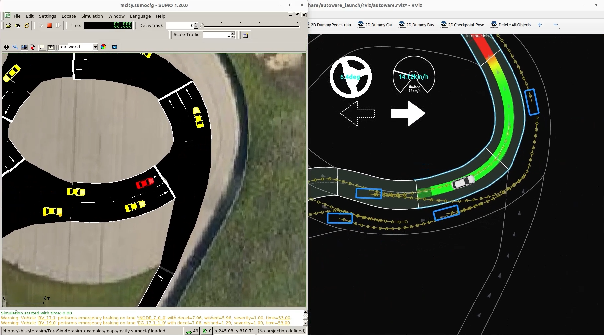

# Autoware Co-Simulation

This guide explains how to connect Autoware's planning simulator to traffic actors including vehicles and traffic lights generated by TeraSim.

### Additional Requirements

- __Hardware__: A CPU based on Intel x86 architecture with at least 16 cores and 16 GB of system memory.

### Additional Dependency

- [__Autoware__](https://github.com/michigan-traffic-lab/autoware): Follow the installation instructions for the mcity-dedicated version of autoware until you can successfully run the provided short demonstrations. This step may take 4-6 hours.

## Run Autoware Co-Simulation

[](https://drive.google.com/file/d/1WZNYCaGM5DhwXYvEgh8w2F0q_mq13v0Z/view?usp=sharing)

Run the autoware co-simulation auxiliary scripts. This synchronizes background vehicles and traffic light states from TeraSim to Autoware, and synchronizes CAV information from Autoware back to TeraSim.

```bash
# Terminal 1
ros2 launch autoware_cosim sim.launch.py
```

Start the autoware planning simulator. Use _2D Pose Estimate_ to initialize the vehicle and _2D Goal pose_ to select a destination for path planning. Alternatively, you can run a script to automate this process. Detailed instructions are provided in the Autoware repository.

```bash
# Terminal 2
ros2 launch autoware_launch planning_simulator.launch.xml map_path:=$HOME/autoware/map vehicle_model:=sample_vehicle sensor_model:=sample_sensor_kit lanelet2_map_file:=lanelet2_mcity_v43.osm
```

Run the TeraSim script (construction zone is currently not supported in Autoware):
```bash
# Terminal 3
python3 default_sumo_example.py
```