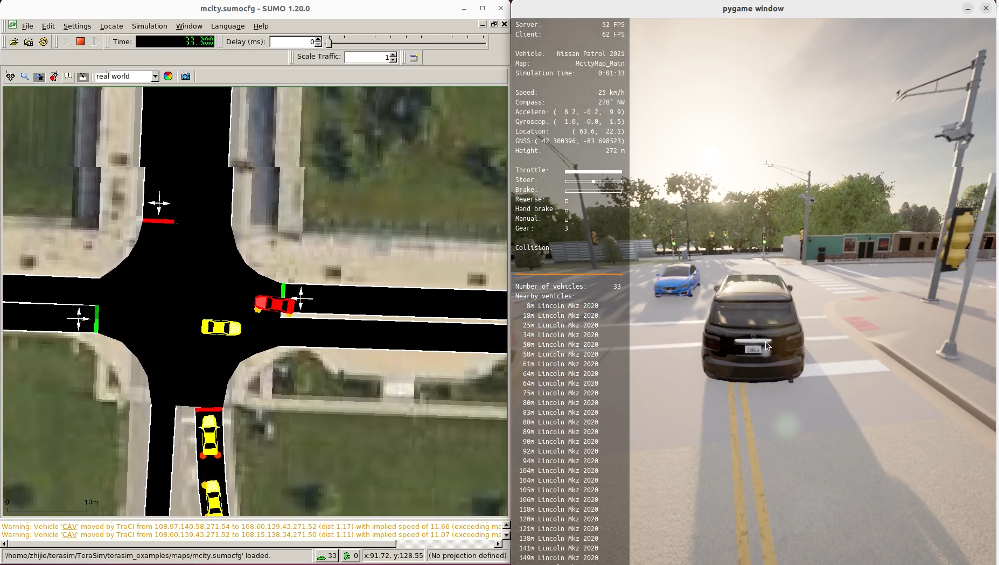

# CARLA Co-Simulation

This guide explains how to connect a CARLA controlled CAV to traffic actors including vehicles and traffic lights generated by TeraSim.

### Additional Requirements

- __Hardware__: A CPU based on Intel x86 architecture with at least 16 cores, 16 GB of system memory, and a dedicated GPU with at least 8 GB of VRAM.

### Additional Dependency

- [__CARLA__](https://github.com/carla-simulator/carla/releases): Download the Ubuntu version of CARLA_0.9.15.tar.gz. Follow the [official instructions](https://carla.readthedocs.io/en/latest/start_quickstart/#running-carla) to make sure you can run simple server and client experiments.

- [__Mcity Digital Twin__](https://github.com/mcity/mcity-digital-twin): Follow the installation instructions to configure _Packaged Version of CARLA_. Make sure you can successfully load the Mcity Ditigal Twin in the CARLA server.

## Run CARLA Co-Simulation

[](https://drive.google.com/file/d/1LJ7LuDEx4cIMGZPfYVdRs1jOGqq8vOec/view?usp=drive_link)


Start a CARLA server:

```bash
# Terminal 1
./CarlaUE4.sh
```

Load the Mcity Digital Twin Map:
```bash
# Terminal 2
python3 load_mcity_digital_twin.py
```

Create a CAV in CARLA. Use the keyboard arrow keys (Up, Down, Left, Right) to manually control the vehicle through the CARLA pygame window interface.

```bash
# Terminal 3
cd examples/carla_examples
python3 carla_av_simple.py
```

Run the CARLA co-simulation script. This synchronizes background vehicles and traffic light states from TeraSim to CARLA, and synchronizes CAV information from CARLA back to TeraSim.

```bash
# Terminal 4
cd examples/carla_examples
python3 carla_cosim_simple.py
```

Run the TeraSim script:
```bash
# Terminal 5
cd examples/terasim_examples
python3 default_sumo_example.py
```

## Run CARLA Sensors

Additionally, define your AV sensors in the `sensor_config.yaml` file and publish them as ROS topics!

```bash
# Launch the sensor node to publish all defined sensors
python3 carla_sensor_ros2.py

# Visualize the outputs from all sensors
python3 carla_sensor_vis.py
```

[](https://drive.google.com/file/d/1LJ7LuDEx4cIMGZPfYVdRs1jOGqq8vOec/view?usp=drive_link)