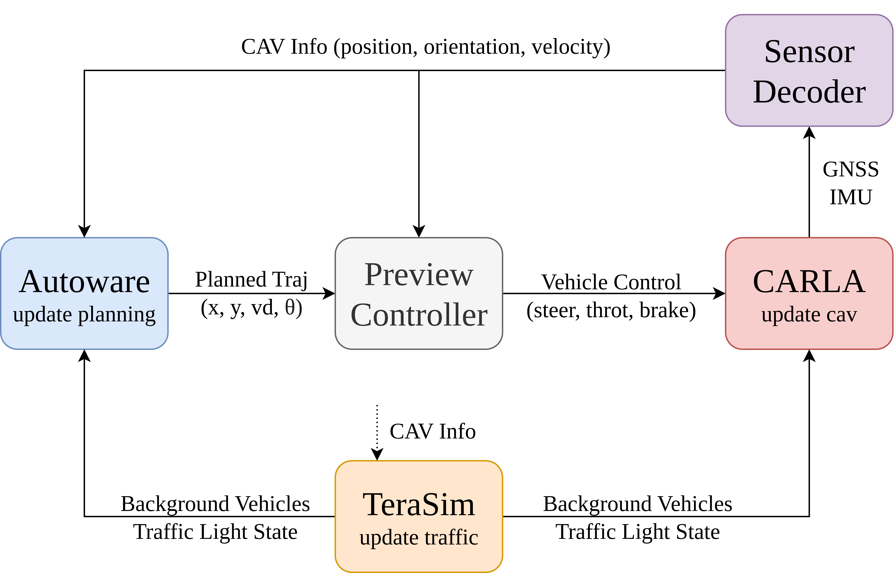

# Closed-Loop Co-Simulation

This guide explains how to run a fulll stack closed-loop simulation including TeraSim, Autoware, and CARLA, fully capturing the fidelity and benefits of real-world vehicle testing.

We strongly encourage users to complete the [Autoware co-simulation](autoware.md) and [CARLA co-simulation](carla.md) sections to ensure all platforms are fully functional and to gain familiarity before proceeding to this section.

### Additional Requirements

- __Hardware__: A CPU based on Intel x86 architecture with at least 24 cores, at least 24 GB of system memory, and a dedicated GPU with at least 12 GB of VRAM.

### Additional Dependency

- [__Autoware__](https://github.com/michigan-traffic-lab/autoware): Follow the installation instructions for the mcity-dedicated version of autoware until you can successfully run the provided short demonstration. This step may take 4-6 hours.

- [__CARLA__](https://github.com/carla-simulator/carla/releases): Download the Ubuntu version of CARLA_0.9.14.tar.gz. Follow the [official instructions](https://carla.readthedocs.io/en/latest/start_quickstart/#running-carla) to make sure you can run simple server and client tests.

- [__Mcity Digital Twin__](https://github.com/mcity/mcity-digital-twin): Follow the installation instructions to configure _Packaged Version of CARLA_. Make sure you can successfully load the Mcity Ditigal Twin in the CARLA server.

## Run CARLA Co-Simulation

This section describes how to perform closed-loop vehicle testing using the CARLA simulator integrated with the Autoware autonomous driving software stack. A high level system architecture diagram is shown below:



Upon successful execution of the scripts outlined above, two operational modes—Manual and Autonomous—will be available.

Manual Mode: In Manual Mode, use the keyboard arrow keys (Up, Down, Left, Right) to manually control the vehicle through the CARLA pygame window interface. As you drive manually, the vehicle's location will be continuously updated and displayed in Autoware.

Autonomous Mode: To switch to Autonomous Mode, press the keyboard key p. Once activated, the ego vehicle will automatically begin motion controlled by the Autoware stack. To return to Manual Mode, press p again.

Start a CARLA server:

```bash
# Terminal 1
./CarlaUE4.sh
```

Load the Mcity Digital Twin Map:
```bash
# Terminal 2
python3 load_mcity_digital_twin.py
```

Start a manually controlled CAV in CARLA:

```bash
# Terminal 3
cd carla_examples
python3 carla_av_ros2.py
```

Run the CARLA co-simulation script.

```bash
# Terminal 4
cd carla_examples
python3 carla_cosim_ros2.py
```

Run the gnss sensor decoder to extract cav state information.
```bash
# Terminal 5
ros2 run gnss_decoder gnss_decoder
```

Run the autoware co-simulation auxiliary scripts for the real car.

```bash
# Terminal 6
ros2 launch autoware_cosim realcar.launch.py
```

Start the Autoware real-car software stack. You should see the state of CARLA’s autonomous vehicle reflected in the Autoware RViz interface. You can now use the “2D Goal Pose” tool to set a destination and initiate planning.

```bash
# Terminal 7
ros2 launch autoware_launch autoware.launch.xml map_path:=$HOME/autoware/map vehicle_model:=sample_vehicle sensor_model:=sample_sensor_kit lanelet2_map_file:=lanelet2_mcity_v43.osm
```

Run the preview controller, which receives planning inputs and generates control commands including steering, throttle, and brake, to drive the vehicle in CARLA.

```bash
# Terminal 8
ros2 launch preview_control carla_control.launch.py
```


Run the TeraSim scripts by selecting one of the following options:

```bash
# Terminal 9

# 1.Naturalistic and Adversarial Driving Simulation (https://www.nature.com/articles/s41467-021-21007-8)
python3 safetest_nade_example.py

# 2.SUMO controlled vehicle simulation 
python3 default_sumo_example.py

# 3.SUMO controlled pedestrian simulation 
python3 pedestrian_example.py

# 4.SUMO controlled bicycle and motorcycle simulation 
python3 cyclist_example.py

# 5.Contruction zone simulation with blocked road segment
python3 construction_example.py
```
