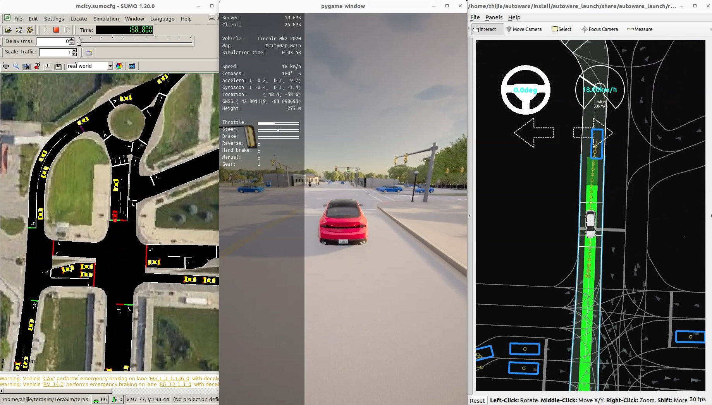

# TeraSim

## Introduction

**TeraSim** is a state-of-the-art traffic simulation environment meticulously designed for the precise evaluation of autonomous vehicle (AV) safety performance. Building upon the robust foundation of SUMO, TeraSim significantly enhances simulation fidelity with advanced traffic behavior modeling and high-precision maneuver execution capabilities.

A key feature of TeraSim is its co-simulation functionality, which enables seamless integration with open-source industry-standard tools such as [**CARLA**](carla.md) and [**Autoware**](autoware.md), facilitating comprehensive testing that combines TeraSim's advanced traffic modeling with high-fidelity sensor simulation and accurate vehicle dynamics.

[](https://drive.google.com/file/d/1u6OdS7pXT07o6_llDUbkK8WeDDXhVZkx/view?usp=drive_link)

## Installation

### Base Requirements

- __Hardware__: A CPU based on Intel x86 architecture with at least 12 cores and 8 GB of system memory.

- __System__: Ubuntu 22.04 (native system installation rather than a virtual machine or Windows Subsystem for Linux).

- __Python__: 3.10 (native to Ubuntu 22.04).

### Dependency

- [__Redis__](https://redis.io/docs/latest/operate/oss_and_stack/install/install-redis/install-redis-on-linux/): follow the instructions to install Redis service.

### Clone the Repository
```bash
git clone https://github.com/michigan-traffic-lab/TeraSim.git
```

### Install the Packages
```
bash install.sh
```

## Run TeraSim

Set up a Redis server and leave it running in the background:

```
redis-server
```

To run TeraSim, navigate to the example directory:
```
cd examples/terasim_examples
```

TeraSim offers multimodal examples:

```bash
# 1.Naturalistic and Adversarial Driving Simulation (https://www.nature.com/articles/s41467-021-21007-8)
python3 safetest_nade_example.py

# 2.SUMO controlled vehicle simulation 
python3 default_sumo_example.py

# 3.SUMO controlled pedestrian simulation 
python3 pedestrian_example.py

# 4.SUMO controlled bicycle and motorcycle simulation 
python3 cyclist_example.py

# 5.Contruction zone simulation with blocked road segment
python3 construction_example.py
```

## TeraSim Co-Simulation

Run TeraSim co-simulation with [**Autoware**](autoware.md).

Run TeraSim co-simulation with [**CARLA**](carla.md).

Run Terasim, Autoware, and CARLA for a [**Full-Stack Closed-Loop Simulation**](fullstack.md).


## Developer

Zhijie Qiao: zhijieq@umich.edu

Haowei Sun: haoweis@umich.edu

Haojie Zhu: zhuhj@umich.edu

Sean Shen: shengyin@umich.edu

## License

Distributed under the MIT License.

## Contact

- Henry Liu - henryliu@umich.edu - Michigan Traffic Lab


